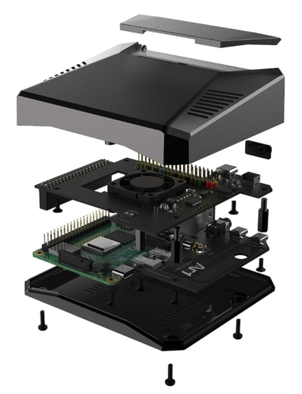

<!-- PROJECT LOGO -->
 

  

  <h3 align="center">Dashboard</h3>

  

    Web application designed for industrial process visualisation, control and analysis 
     
    <a href="https://github.com/marutimuthu/dashboard"><strong>Explore the docs »</strong></a>
     
     
  
  

  

<!-- TABLE OF CONTENTS -->
# Table of Contents

* [Features](#features)
* [Technology Overview](#techoverview)
    * [Frontend](#frontend)
    * [Backend](#backend)
* [References](#references)

# Features:

1. Monitor `[ LIVE ]`
  * Machine Performance
2. Control [ Version 3 ]
  * Schedule Machine Operations
  * Control peripherals
3. Log [ Version 3 ]
  * Changes by operator
  * Machine parameters
4. Configure `[ LIVE ]`
  * Process Parameters
5. Analyse `[ LIVE ]`
  * Machine Performance
6. Restrict unauthorised access `[ LIVE ]` 
7. Reports 
  * Production Report [ PDF ]
  * Machine Raw Data [ CSV or Excel ]

# Technology Overview:

### This dashboard is designed to work on premise without active internet connection. 
 

# Installation

## Single command installation!

`sh -c "$(wget -O- https://raw.githubusercontent.com/marutimuthu/dashboard-installer/master/powerup.sh?token=AHDKO5BOOHYUXWNQR4QAKGC7MTCVY)"`

Note: Check logs to start pm2 on boot

# UI:

http://localhost:3000

# APIs:

NPM Packages APIs:

`/charts` -> `/node_modules/chart.js/dist/`

`/css` -> `/node_modules/tailwindcss/dist/`

`/font` -> `/node_modules/@fortawesome/fontawesome-free/`

Proprietarty scripts

`/fulmine/` -> Currently on Index.HTML 

User related APIs:

`/onboard/:namee/:machinee/:recepiee/:batchh` -> To onboarding the user

`/api/continue` -> Not developed yet (Should restore previous session)

Realtime data APIs:

`/api/payload` -> Realtime data

`/api/machine` -> Machine data

Search APIs:

`/api/search/:rotationn` -> Returns rotation result of current batch

`/api/search/average/:batch` -> Returns total rotation count, pre main ejn average values

`/api/batch` -> Gives total count of batches and batch names

Report APIs:

`/report/template` -> HTML template for the report 

`/report/average/:batch/:from/:to` -> Sets the *report* object (batch, from and to) in router

`/report/average/now` -> Returns the *report* object (batch, from and to) from router

`/report/average/generate` -> Spawns puppeteer to generate the PDF

System APIs:

`/restart/:what` -> Used to restart either Device, pm2 service

# Kiosk Setup

[Kiosk Setup!](https://github.com/futurice/chilipie-kiosk)

# Speed up boot time 
[Reference](http://himeshp.blogspot.com/2018/08/fast-boot-with-raspberry-pi.html)